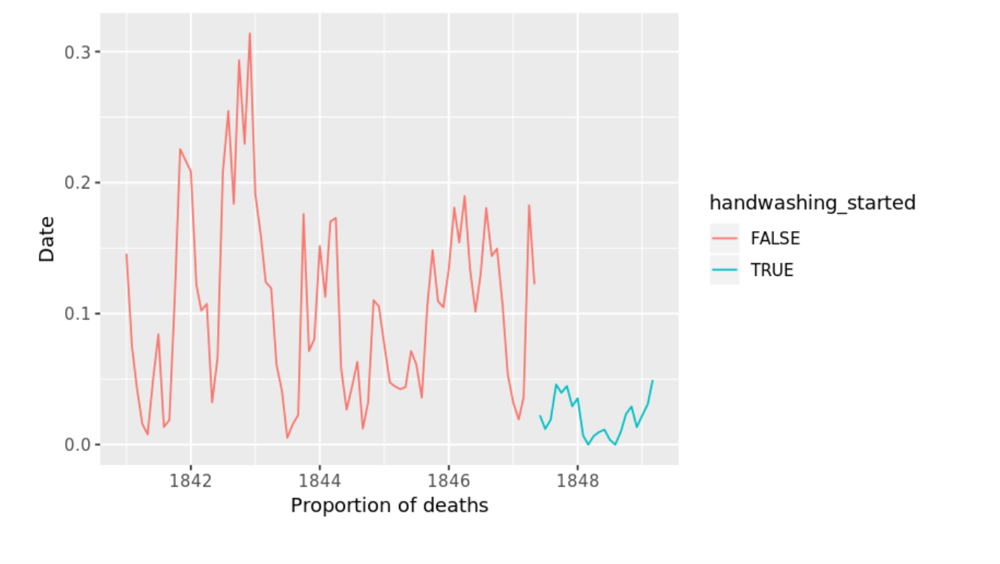

# Handwashing
Project through DataCamp: Dr. Semmelweis and the Discovery of Handwashing

Utilized tidyverse’s ggplot to display the differences hand washing made in 1800s hospital deaths. Also 
used the t.test function to calculate a 95% confidence interval around the increase of deaths related to unsanitary habits.

Learned data manipulation and data visualization using python and the pandas data frame.

 
